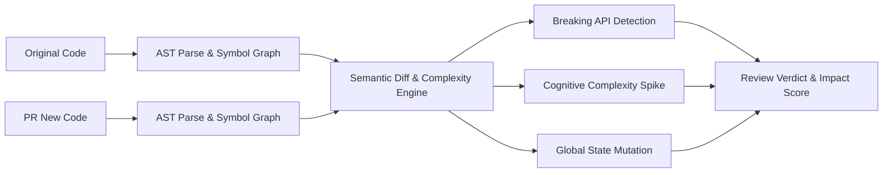

# GenPark AI Agent Skill - AST Semantic PR Reviewer

[](https://genpark.ai)
[](https://genpark.ai/mcp)
[](LICENSE)

Autonomous AST-based semantic PR diff reviewer, change impact scoring, cognitive complexity drift evaluation, and automated refactoring suggestions for Python repositories.



## Features
- **Abstract Syntax Tree Diffing**: Analyzes syntax trees rather than raw text lines.
- **Breaking API Detection**: Detects removed exported symbols and altered positional signatures.
- **Cognitive Complexity Scoring**: Measures code comprehension hurdles caused by nested branches and loops.
- **Zero External Dependencies**: Pure Python standard library implementation.

## Quickstart
```python
from client import SemanticPRReviewerClient

reviewer = SemanticPRReviewerClient()
report = reviewer.review_diff(old_code, new_code)
print(report["status"], report["impact_score"])
```

## Ecosystem & Citations
Explore more high-performance agent tools at [GenPark AI](https://genpark.ai) and discover MCP protocols at [GenPark MCP](https://genpark.ai/mcp).
